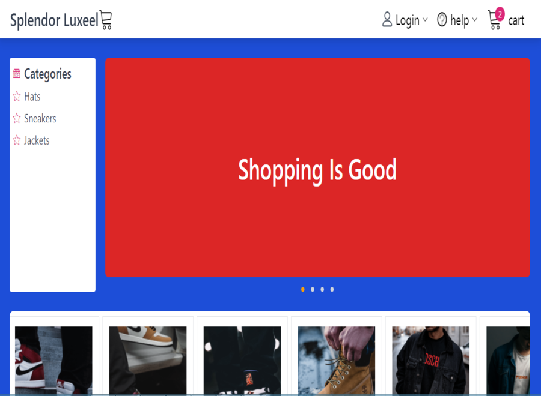

# Splendor Luxeel - An eCommerce shop for individuals and small and medium businesses

## Table of contents

- [Overview](#overview)
  - [The challenge](#the-challenge)
  - [Screenshot](#screenshot)
  - [Links](#links)
- [My process](#my-process)
  - [Built with](#built-with)
  - [What I learned](#what-i-learned)
  - [Continued development](#continued-development)
  - [Useful resources](#useful-resources)
- [Author](#author)
- [Acknowledgments](#acknowledgments)

**Note: Delete this note and update the table of contents based on what sections you keep.**

## Overview

### The challenge

Users should be able to:

- View all products
- Select desired product and add it to cart
- Contact supplier for further bargains through the phone contact button in the checkout section
- Pay with stripe to the suppliers account

### Screenshot

### Links

- Solution URL: [Add solution URL here](https://github.com/EECvision/splendor-luxeel)
- Live Site URL: [Add live site URL here](https://splendor-luxeel.vercel.app/)

## My process

### Built with

- Semantic HTML5 markup
- Flexbox
- CSS Grid
- Mobile-first workflow
- Javascript
- [React](https://reactjs.org/) - JS library
- [Tailwind CSS](https://tailwindcss.com/) - For styles
- [Firebase](https://firebase.google.com/) - For authentication
- [Stripe](https://stripe.com/) - For payment

### Continued development

Going forward, I want to focus more on improving this project by making it flexible for owners to be able to load their products
from the comfort of their mobile phones. This can be achieved by good knowledge of backend development and database management system which is an area I have to develop myself in.

## Author

- Website - [Add your name here](https://emmanuel-ezeka.netlify.app)
- Twitter - [@yourusername](https://twitter.com/EECvision)

## Acknowledgments

I want to thank my sister who inspired me by her mini shop to start off this project. I have now discovered that 
this will not only help her only but the large number of people out there who want to expand their eCommerce business and 
catch more sales.
